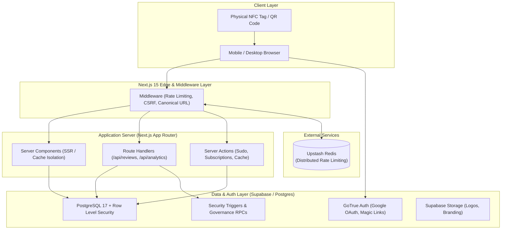

# Avalia Prudente

<div align="center">
  
  <p align="center">
    <strong>The NFC-Powered Reputation & Review Ecosystem for Local Commerce.</strong><br />
    Bridging physical customer interactions and digital reputation through smart, tap-to-rate experiences.
  </p>

  <p align="center">
    <a href="https://avaliaprudente.com.br"></a>
    <a href="docs/ARCHITECTURE.md"></a>
    <a href="LICENSE"></a>
    <a href="https://github.com/felipe-seabra/avaliaprudente.com.br/actions"></a>
  </p>
</div>

---

## Overview

**Avalia Prudente** is a modern Reputation-as-a-Service (RaaS) platform built for local businesses, merchants, and service providers. 

In physical brick-and-mortar retail, collecting customer reviews is plagued by friction: customers forget, links are difficult to type, and businesses struggle to convert happy store visits into digital social proof. Avalia Prudente solves this with **NFC-powered smart interactions** and **dynamic QR landing pages**. By tapping their smartphone on a counter-top smart tag, customers instantly land on an authentic review page tailored to that business—no app download required.

The platform provides businesses with verified feedback collection, official response threads, reputation scoring, and link hubs, backed by a resilient, privacy-first anti-abuse infrastructure.

---

## Key Features

- **🏢 Business Profiles & Smart Pages:** Customizable public pages (`/r/[slug]`) with business branding, operating hours, themes, and social links.
- **⭐ Reputation & Review Ecosystem:** Multi-tier reviewer scoring, verified purchase tags, and a transparent Bayesian ranking algorithm for local discovery.
- **📲 NFC-Powered Tap-to-Rate:** Cinematic, low-latency mobile experience triggered via physical NFC chips with automatic QR code fallback.
- **🔗 Smart Link Management:** Centralized linktree-style hubs allowing businesses to route visitors to WhatsApp, menus, maps, and social profiles.
- **📈 Anti-Inflation Analytics:** Page visit and CTA click tracking protected against metric manipulation via cryptographic server-side deduplication.
- **🛡️ Multi-Tier Verification:** Official merchant verification workflows with trust seals and auditable verification history.
- **⚖️ Moderation & Governance:** Enterprise-grade Role-Based Access Control (RBAC), community moderation center, formal warning/suspension systems, and appeal processing.
- **🔒 Defensive Anti-Abuse:** Multi-layered defense including daily-rotating privacy fingerprinting, distributed rate limiting, and database-level insertion cooldowns.

---

## Product Architecture



---

## Tech Stack

| Domain | Technology | Purpose |
| :--- | :--- | :--- |
| **Framework** | [Next.js 15](https://nextjs.org/) (App Router, Server Actions) | React full-stack foundation with hybrid rendering |
| **Core UI** | [React 19](https://react.dev/) | Server & Client components with concurrent features |
| **Language** | [TypeScript 5](https://www.typescriptlang.org/) (Strict Mode) | End-to-end static type safety |
| **Styling & UI** | [Tailwind CSS 4](https://tailwindcss.com/), [shadcn/ui](https://ui.shadcn.com/), [Radix UI](https://www.radix-ui.com/) | Accessible, responsive design system |
| **State Management** | [TanStack React Query 5](https://tanstack.com/query) | Client caching, optimistic updates, and infinite scrolling |
| **Database** | [PostgreSQL 17](https://www.postgresql.org/) via [Supabase](https://supabase.com/) | Relational database with automated migration management |
| **Authentication** | [Supabase SSR](https://supabase.com/docs/guides/auth/server-side) | Cookie-based session management with OAuth & Magic Link |
| **Rate Limiting** | [Upstash Redis](https://upstash.com/) + `@upstash/ratelimit` | Distributed sliding-window rate limiting on edge runtimes |
| **Validation** | [Zod](https://zod.dev/) & [React Hook Form](https://react-hook-form.com/) | Runtime type validation for forms, APIs, and env vars |
| **Testing** | [Vitest](https://vitest.dev/) & [Testing Library](https://testing-library.com/) | Unit, integration, and security regression testing |

---

## Architecture

Avalia Prudente is structured around **Clean Architecture** principles, maintaining strict separation between business rules and delivery mechanisms:

```
src/
├── app/               # Presentation Layer: Routes, Layouts, Server Actions, API Handlers
├── components/        # Presentation Layer: UI Primitives & Domain-specific Widgets
├── core/
│   ├── domain/        # Domain Layer: Pure Enterprise Entities & Type Definitions
│   ├── application/   # Application Layer: Business Use Cases & Service Contracts
│   └── infrastructure/# Infrastructure Layer: Repositories & Supabase Adapters
├── hooks/             # Presentation Layer: Reusable Client Hooks
└── lib/               # Shared Utilities: Security, Logging, Privacy, Rate Limiting
```

- **Domain Layer (`src/core/domain`):** Contains enterprise business models (`Business`, `Review`, `BusinessPage`, `Subscription`) independent of frameworks, databases, or third-party SDKs.
- **Application Layer (`src/core/application`):** Contains orchestrating use cases (e.g. `get-public-rankings.ts`) and abstract services (e.g. `billing-service.ts`) enforcing business rules.
- **Infrastructure Layer (`src/core/infrastructure`):** Implements data access repositories (`supabase-business-repository.ts`, `supabase-review-repository.ts`), translating database operations to domain entities.
- **Presentation Layer (`src/app`, `src/components`):** Implements hybrid rendering:
  - **SSR & ISR:** Public profile pages (`/r/[slug]`) and rankings are server-rendered with edge cache invalidation for instant loading and SEO discoverability.
  - **Client-Side Enclaves:** Authenticated administration panels (`/dashboard`, `/admin`) leverage React Query for responsive interactions.

---

## Security Model

The platform operates under a **Zero Client Trust** security architecture:

1. **Row Level Security (RLS):** Every PostgreSQL table enforces tenant isolation via RLS policies. Direct unauthenticated client writes are disabled; sensitive mutations pass through server-side authenticated boundaries.
2. **Protected Privileged Fields:** Database `BEFORE UPDATE` triggers ([`20260903100000_protect_business_privileged_fields.sql`](supabase/migrations/20260903100000_protect_business_privileged_fields.sql)) prevent non-admin users from altering sensitive attributes (such as `is_verified`, `is_frozen`, or `plan_type`) directly via PostgREST APIs.
3. **Cross-Site Request Forgery (CSRF) Defense:** Middleware validates `Host` and `X-Forwarded-Host` against request `Origin` headers on state-changing HTTP verbs (`POST`, `PUT`, `DELETE`, `PATCH`).
4. **Distributed Rate Limiting:** Multi-tiered sliding-window limits protect sensitive endpoints (`/api/*`, `/login`, `/register`) using Upstash Redis with fail-safe in-memory dev fallbacks.
5. **Privacy-Preserving Fingerprinting (LGPD Compliance):** Anti-fraud signals combine client characteristics with a daily-rotating salt and server pepper (`SHA-256(IP + UA + Salt + Pepper)`). Raw IP addresses and raw User-Agents are never stored in plain text.
6. **Sudo Re-Authentication Mode:** High-impact operations (e.g., account deletion, subscription modifications) require fresh HMAC-signed token verification within a 15-minute elevation window.
7. **Strict Security Headers:** Next.js middleware and configuration apply strict Content Security Policies (CSP), `X-Frame-Options: DENY`, `X-Content-Type-Options: nosniff`, and Referrer policies.
8. **Runtime Environment Validation:** Server startup validates all configuration variables via Zod schemas, enforcing fail-closed behavior in production.

---

## Getting Started

### Prerequisites

- **Node.js:** `24.x` (LTS recommended)
- **Package Manager:** `npm` (bundled with Node)
- **Docker:** Installed and running (required for local Supabase database stack)
- **Supabase CLI:** Installed locally (`brew install supabase/tap/supabase` or via `npx`)

### Installation

1. **Clone the repository:**
   ```bash
   git clone https://github.com/felipe-seabra/avaliaprudente.com.br.git
   cd avaliaprudente.com.br
   ```

2. **Install dependencies:**
   ```bash
   npm ci
   ```

3. **Configure Environment Variables:**
   ```bash
   cp .env.example .env.local
   ```
   *(Populate `.env.local` with your local or development credentials. See [Environment Variables](#environment-variables) below).*

4. **Start the local Supabase environment:**
   ```bash
   npm run supabase:start
   ```

5. **Start the development server:**
   ```bash
   npm run dev
   ```
   Open [http://localhost:3000](http://localhost:3000) in your browser.

6. **Create a Production Build:**
   ```bash
   npm run build
   npm run start
   ```

---

## Environment Variables

All variables are declared and validated using Zod in `src/lib/env.ts`.

| Variable | Scope | Required | Description |
| :--- | :--- | :--- | :--- |
| `NEXT_PUBLIC_APP_URL` | Public / Browser | Yes | Canonical base URL (e.g. `http://localhost:3000` or `https://www.avaliaprudente.com.br`) |
| `NODE_ENV` | Server | Yes | Environment mode (`development`, `test`, `production`) |
| `NEXT_PUBLIC_SUPABASE_URL` | Public / Browser | Yes | Supabase project API URL (e.g. `http://127.0.0.1:54321` or cloud instance) |
| `NEXT_PUBLIC_SUPABASE_ANON_KEY`| Public / Browser | Yes | Public Supabase anonymous client key |
| `SUPABASE_SERVICE_ROLE_KEY` | Server Only | Yes | Elevated service key for backend route handlers (never expose to client) |
| `NEXT_PUBLIC_AUTH_CALLBACK_URL`| Public / Browser | No | Dedicated auth callback redirect URL |
| `UPSTASH_REDIS_REST_URL` | Server Only | Optional* | Upstash Redis REST API URL for distributed rate limiting |
| `UPSTASH_REDIS_REST_TOKEN` | Server Only | Optional* | Upstash Redis authentication token |
| `SUDO_SECRET` | Server Only | Prod Only | Dedicated HMAC secret for Sudo Mode signing (minimum 32 characters) |
| `FINGERPRINT_PEPPER` | Server Only | Prod Only | Cryptographic pepper for LGPD fingerprinting (minimum 32 characters) |

*\*Note: In development and test modes, Upstash Redis falls back to an in-memory cache if not configured.*

---

## Database & Supabase

The platform uses Supabase CLI for reproducible local development:

- **Start Local Stack:**
  ```bash
  npm run supabase:start
  ```
- **Apply Schema Migrations:**
  ```bash
  npm run supabase:reset
  ```
- **Create a New Migration:**
  ```bash
  npx supabase migration new <migration_name>
  ```
- **Safe Database Push Guard:**
  Destructive remote operations are guarded by [`scripts/db-safety.sh`](scripts/db-safety.sh) to prevent accidental wipes on staging or cloud environments:
  ```bash
  npm run db:push
  ```

---

## Testing & Quality Assurance

Avalia Prudente enforces multi-tier quality gates:

```bash
# Run unit, integration, and security regression tests
npm run test

# Run tests in watch mode
npm run test:watch

# Execute TypeScript typechecking across the entire codebase
npm run typecheck

# Run ESLint validation
npm run lint

# Security dependency audit
npm audit --audit-level=high

# Production build verification
npm run build
```

### Critical Security Test Suites
- [`src/lib/sudo.test.ts`](src/lib/sudo.test.ts): Verifies Sudo token integrity, expiry enforcement, and service-role key separation.
- [`src/lib/privacy.test.ts`](src/lib/privacy.test.ts): Verifies pepper isolation, daily hash rotation, and fail-closed production checks.
- [`src/lib/env.test.ts`](src/lib/env.test.ts): Validates schema enforcement and production entropy rules.
- [`src/core/infrastructure/repositories/sec-04-protected-fields.test.ts`](src/core/infrastructure/repositories/sec-04-protected-fields.test.ts): Validates database column-level protection on privileged fields.

---

## Project Structure

```
├── .github/
│   └── workflows/
│       └── ci.yml               # Automated CI pipeline (Lint, Typecheck, Test, Audit, Build)
├── docs/                        # Architecture guides, ADRs, and deployment documentation
├── public/                      # Static branding, logos, and vector assets
├── scripts/
│   ├── db-safety.sh             # Operational guard for Supabase cloud migrations
│   └── docker-maintenance.sh    # Local Docker cache & disk maintenance
├── src/
│   ├── app/                     # Next.js 15 App Router pages, layouts, and API routes
│   │   ├── (auth)/              # Login, registration, and password recovery
│   │   ├── admin/               # Platform administration and governance center
│   │   ├── api/                 # Server-side API endpoints (reviews, analytics, webhooks)
│   │   ├── dashboard/           # Merchant SaaS management portal
│   │   └── r/[slug]/            # High-performance public merchant pages
│   ├── components/              # Modular UI components & design system
│   ├── core/                    # Clean Architecture: Domain, Application, and Infrastructure
│   ├── hooks/                   # Custom React hooks
│   ├── lib/                     # Utilities (logger, rate-limit, privacy, sudo, supabase)
│   ├── providers/               # Context providers (Theme, Auth, QueryClient)
│   └── types/                   # TypeScript definitions & Supabase generated database types
└── supabase/
    ├── config.toml              # Local Supabase emulator configuration
    ├── migrations/              # Version-controlled SQL migrations
    └── seed.sql                 # Development database seeds
```

---

## Development Workflow

1. **Branching Strategy:**
   - `main`: Production-ready branch. Direct pushes are protected.
   - `feat/<feature-name>`: Feature development.
   - `fix/<issue-name>`: Bug fixes and performance adjustments.
   - `security/<hardening-name>`: Dedicated security patches and audit remediations.
2. **Conventional Commits:** Commits follow conventional standard formatting:
   - `feat:` New user-facing capabilities
   - `fix:` Bug or regression fixes
   - `security:` Defensive hardening and credential isolation
   - `chore:` Dependency updates and configuration maintenance
   - `docs:` Documentation improvements
3. **Pull Requests & CI:** All PRs must pass the automated GitHub Actions pipeline (`npm ci`, `npm run lint`, `npm run typecheck`, `npm run test`, `npm audit --audit-level=high`, and `npm run build`).

---

## Deployment

The application is architected for continuous delivery on **Vercel** paired with **Supabase Cloud**:

1. **Frontend (Vercel):**
   - Connect the repository to Vercel.
   - Framework preset: `Next.js`.
   - Node.js version: `24.x`.
   - Configure all environment variables matching `.env.example`.
2. **Database (Supabase Cloud):**
   - Link project via Supabase CLI: `npx supabase link --project-ref <project-id>`.
   - Synchronize database schema: `npm run db:push`.
   - Enable Point-in-Time Recovery (PITR) and configure custom SMTP for production authentication.
3. **Domain & SSL:**
   - Configure canonical DNS routing to `www.avaliaprudente.com.br` with automatic SSL provisioning.

---

## Security Disclosure

We take the security of our platform and user data seriously. If you discover a vulnerability or potential security weakness in this repository:

- **Do NOT open a public GitHub issue.**
- Please send a report with steps to reproduce to **[seguranca@avaliaprudente.com.br](mailto:seguranca@avaliaprudente.com.br)**.
- We will acknowledge receipt of your vulnerability report within 48 hours and provide a resolution timeline.

---

## Roadmap

The following enhancements are planned on the engineering roadmap:

- [ ] **Billing & Monetization:** Complete Stripe Checkout & Customer Portal integration with automated webhook handlers.
- [ ] **Self-Service NFC Ordering:** Integrated e-commerce flow for merchants to order physical, pre-programmed NFC tags and counter stands directly from the dashboard.
- [ ] **Advanced Merchant Analytics:** Real-time customer sentiment analysis, peak-hour rating heatmaps, and automated CSV/PDF export.
- [ ] **Automated LGPD Erasure:** Hard-delete and PII anonymization workflow for user account deactivation requests.
- [ ] **Multi-Branch Management:** Unified administration for multi-location local retail franchises.

---

## License

This project is licensed under the **MIT License** — see the [LICENSE](LICENSE) file for details.

---

## Author / Project

- **Project:** Avalia Prudente
- **Website:** [https://www.avaliaprudente.com.br](https://www.avaliaprudente.com.br)
- **Maintainer:** Felipe Seabra
- **Location:** Presidente Prudente, SP — Brazil
